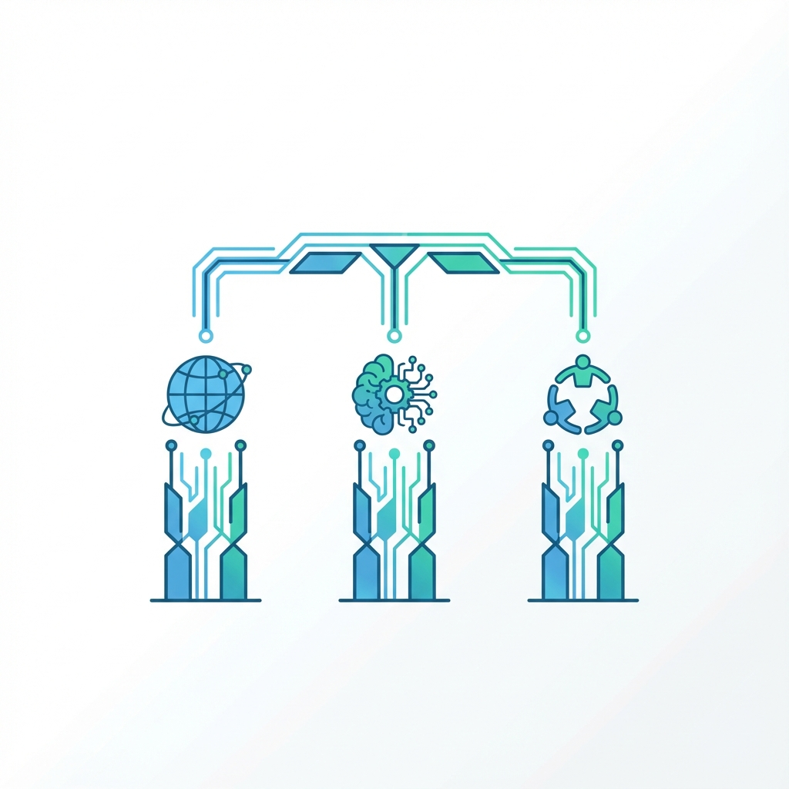

# UAS-1 My Concepts

**EduBridge: Menjembatani Kesenjangan Pendidikan melalui Teknologi Cerdas**

## Latar Belakang Masalah

Dari 10 masalah kemanusiaan terbesar, saya memilih **Kurangnya Akses Pendidikan** sebagai fokus Masterpiece saya. Menurut data PBB 2024, sekitar 183,5 juta anak membutuhkan bantuan pendidikan, terutama di daerah konflik dan terpencil. Di Indonesia sendiri, kesenjangan pendidikan antara kota dan desa masih sangat lebar.

Saya percaya bahwa **pendidikan adalah kunci untuk menyelesaikan hampir semua masalah kemanusiaan lainnya** - dari kemiskinan hingga ketidaksetaraan. Namun, akses terhadap pendidikan berkualitas masih menjadi privilese, bukan hak universal.

## Konsep: EduBridge Framework

Konsep saya bernama **EduBridge** - sebuah framework untuk menjembatani kesenjangan pendidikan menggunakan Sistem dan Teknologi Informasi di era AI. Framework ini memiliki tiga pilar utama:

### 1. **Aksesibilitas Universal (Universal Access)**

Pendidikan harus dapat diakses oleh siapa saja, kapan saja, di mana saja. Teknologi AI memungkinkan:
- **Pembelajaran offline-first** yang dapat berjalan tanpa koneksi internet stabil
- **Konten adaptif** yang menyesuaikan dengan perangkat yang tersedia (dari smartphone low-end hingga komputer)
- **Multi-bahasa otomatis** melalui AI translation untuk daerah dengan bahasa lokal berbeda

### 2. **Personalisasi Pembelajaran (Personalized Learning)**

Setiap individu memiliki cara belajar yang berbeda. AI dapat:
- **Menganalisis gaya belajar** dan menyesuaikan metode penyampaian materi
- **Mengidentifikasi kesenjangan pengetahuan** dan memberikan materi remedial yang tepat
- **Memotivasi dengan adaptive pacing** - tidak terlalu cepat yang membuat frustrasi, tidak terlalu lambat yang membuat bosan

### 3. **Pemberdayaan Komunitas (Community Empowerment)**

Teknologi bukan pengganti guru, melainkan penguat. Konsep ini menekankan:
- **Guru sebagai fasilitator** yang diperkuat AI, bukan digantikan
- **Peer-to-peer learning** yang difasilitasi platform digital
- **Keterlibatan orang tua dan komunitas** melalui dashboard pemantauan

## Visi Besar

EduBridge bukan sekadar aplikasi atau platform, melainkan **ekosistem pembelajaran yang inklusif**. Visi saya adalah menciptakan dunia di mana:

> *"Setiap anak, di mana pun mereka berada, memiliki kesempatan yang sama untuk belajar dan berkembang sesuai potensi mereka."*

Dengan menggabungkan kekuatan AI untuk personalisasi massal dan Sistem Informasi untuk distribusi efisien, kita dapat mengubah pendidikan dari privilese menjadi hak yang benar-benar universal.