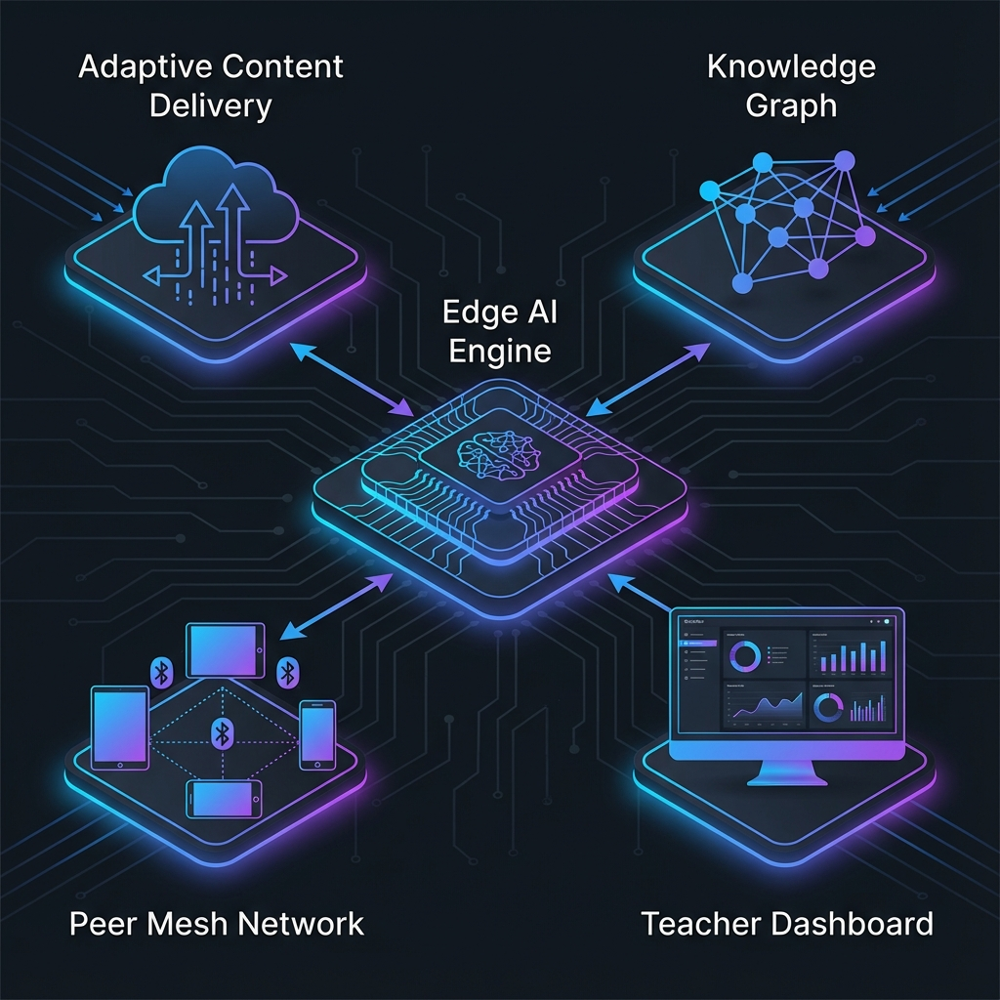

# UAS-3 My Innovations

**EduBridge AI: Sistem Pembelajaran Adaptif Berbasis Edge Computing**

## Latar Belakang

Berdasarkan konsep EduBridge dan opini saya tentang pendidikan inklusif, saya mengembangkan inovasi teknis bernama **EduBridge AI** - sebuah sistem pembelajaran adaptif yang dapat berjalan di perangkat dengan spesifikasi rendah tanpa ketergantungan pada koneksi internet.

## Arsitektur Sistem

EduBridge AI terdiri dari lima komponen utama yang terintegrasi:

### 1. **Edge AI Engine (EAE)**

Ini adalah jantung dari sistem - model AI ringan yang berjalan langsung di perangkat pengguna.

**Spesifikasi:**
- Menggunakan model TinyML dengan ukuran < 50MB
- Berjalan di perangkat Android dengan RAM minimal 1GB
- Tidak membutuhkan koneksi internet untuk inferensi dasar

**Fungsi:**
- Menganalisis pola belajar siswa secara real-time
- Menyesuaikan tingkat kesulitan materi
- Memberikan feedback instan tanpa latency jaringan

### 2. **Adaptive Content Delivery System (ACDS)**

Sistem pengiriman konten yang cerdas berdasarkan kondisi jaringan:

| Kondisi Jaringan | Mode Pengiriman |
|------------------|-----------------|
| Tidak ada koneksi | Konten offline yang sudah di-cache |
| Koneksi lambat (2G/3G) | Teks + audio, tanpa video |
| Koneksi sedang (4G) | Video terkompresi + interaktif |
| Koneksi cepat (WiFi) | Full experience dengan kolaborasi real-time |

### 3. **Knowledge Graph Lokal (KGL)**

Setiap perangkat memiliki knowledge graph mini yang memetakan:
- Konsep yang sudah dikuasai siswa
- Konsep yang masih lemah
- Jalur pembelajaran optimal

Knowledge graph ini di-sinkronisasi ke cloud ketika tersedia koneksi, memungkinkan guru untuk memantau progress.

### 4. **Peer Mesh Network (PMN)**

Ketika berada di area tanpa internet tapi dengan beberapa pengguna:
- Perangkat membentuk jaringan mesh via Bluetooth/WiFi Direct
- Siswa bisa berbagi konten dan belajar bersama
- Progress tetap tersinkronisasi dalam kelompok

### 5. **Teacher Dashboard (TD)**

Interface untuk guru yang menampilkan:
- Progress agregat seluruh kelas
- Identifikasi siswa yang membutuhkan bantuan ekstra
- Rekomendasi materi yang perlu diulang secara klasikal

## Inovasi Kunci

**Yang membedakan EduBridge AI dari solusi EdTech lainnya:**

1. **AI-First, Cloud-Second** - AI berjalan lokal, cloud hanya untuk sinkronisasi
2. **Progressive Enhancement** - Pengalaman meningkat sesuai kemampuan perangkat dan jaringan
3. **Community-Centric** - Peer mesh network membuat pembelajaran tetap sosial walau offline
4. **Teacher-Augmented** - Guru diperkuat dengan insight, bukan digantikan

## Teknologi yang Digunakan

- **TensorFlow Lite / ONNX Runtime** untuk model AI ringan
- **SQLite + Room** untuk penyimpanan lokal
- **Nearby Connections API** untuk peer mesh
- **Flutter** untuk cross-platform development
- **Firebase** untuk sinkronisasi ketika online

## Dampak yang Diharapkan

Dengan EduBridge AI, seorang siswa di desa terpencil dengan smartphone Android bekas dan tanpa internet tetap dapat:
- Belajar dengan kurikulum yang sama dengan siswa kota
- Mendapat personalisasi yang sama berdasarkan kemampuannya
- Berkolaborasi dengan teman-teman sekitarnya
- Terpantau progressnya oleh guru

**Inilah demokratisasi pendidikan yang sebenarnya - bukan memberikan link ke siswa, tapi memberikan seluruh pengalaman belajar.**
