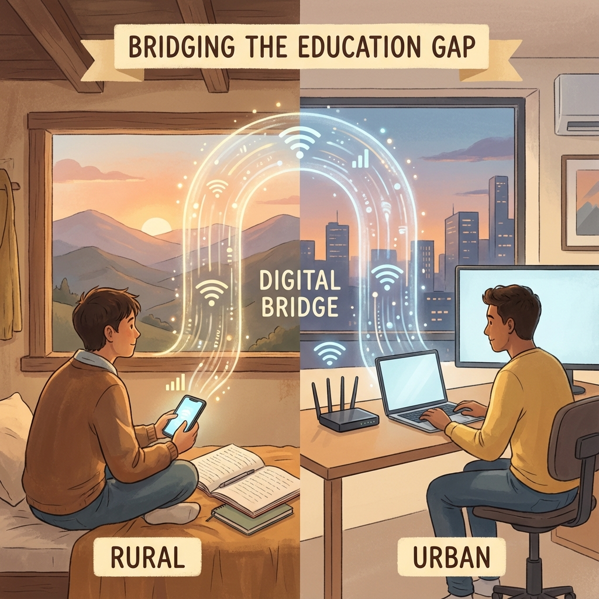

# UAS-2 My Opinions

**Opini: Revolusi Pendidikan Indonesia Harus Dimulai dari Teknologi yang Merakyat**

## Pendahuluan

Indonesia memiliki lebih dari 60 juta pelajar, tersebar di 17.000 pulau dengan infrastruktur yang sangat bervariasi. Namun, kebijakan pendidikan digital kita masih **Jakarta-sentris** - dirancang untuk anak kota dengan akses internet cepat dan perangkat canggih.

Ini adalah opini saya yang tegas: **Revolusi pendidikan Indonesia tidak akan berhasil jika kita terus membangun untuk 20% teratas, sambil berharap 80% sisanya akan "menyusul".**

## Masalah: Digital Divide yang Semakin Lebar

Pandemi COVID-19 mengekspos kesenjangan digital yang brutal. Sementara siswa di Jakarta bisa mengikuti kelas Zoom dengan lancar, siswa di NTT harus naik bukit untuk mencari sinyal. Yang lebih ironis:

- **Platform e-learning pemerintah** membutuhkan bandwidth tinggi
- **Kurikulum digital** diasumsikan semua siswa punya laptop/tablet
- **Ujian online** menjadi tidak adil ketika koneksi menentukan nilai

Kita tidak sedang membangun pendidikan inklusif - kita sedang **memperlebar jurang**.

## Posisi Saya: Technology for the Bottom, Not the Top

Saya percaya pendekatan yang benar adalah **membangun untuk yang paling sulit dijangkau terlebih dahulu**. Ini berarti:

### 1. Offline-First, Online-Enhanced
Semua materi pembelajaran harus bisa diakses offline. Sinkronisasi online adalah bonus, bukan keharusan. WhatsApp dan SMS bisa menjadi channel pembelajaran yang lebih efektif daripada aplikasi mewah yang butuh 4G.

### 2. Low-Tech Device Compatibility
Mayoritas keluarga Indonesia memiliki smartphone Android entry-level dengan RAM 2GB. Aplikasi pendidikan yang membutuhkan RAM 4GB adalah **aplikasi yang memilih siswanya**.

### 3. AI yang Bekerja di Edge, Bukan Cloud
Model AI ringan yang berjalan di perangkat lokal (edge computing) jauh lebih inklusif daripada layanan cloud yang membutuhkan internet stabil.

## Kritik terhadap Tren Saat Ini

Banyak startup EdTech Indonesia yang mengklaim "demokratisasi pendidikan" tapi:
- Membutuhkan langganan berbayar untuk fitur esensial
- Hanya tersedia dalam Bahasa Indonesia formal (bukan bahasa daerah)
- Dirancang untuk siswa yang sudah termotivasi, bukan yang butuh motivasi

**Ini bukan demokratisasi - ini komodifikasi.**

## Solusi yang Saya Usulkan

1. **Regulasi inklusivitas digital** - Wajibkan semua platform EdTech yang didanai pemerintah untuk mendukung mode offline dan perangkat low-end
2. **Kurikulum AI yang etis** - Ajarkan AI literacy bukan hanya di kota, tapi mulai dari desa
3. **Desentralisasi konten** - Libatkan guru lokal dalam pembuatan konten yang relevan secara budaya

## Penutup

Kita tidak bisa menunggu infrastruktur sempurna untuk memulai. Generasi yang kehilangan pendidikan hari ini tidak bisa menunggu kabel fiber optik sampai ke desanya.

**Saatnya kita membalik paradigma: bukan membawa siswa ke teknologi, tapi membawa teknologi kepada siswa - dengan cara yang mereka bisa gunakan.**