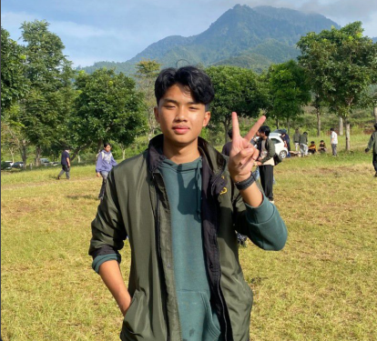

# Selamat Berjumpa {.unnumbered}

{width=50%}

Saya Kyan Saktya Diraya, lahir di Surakarta pada 27 Juni 2006. Saya berasal dari Surakarta, sempat berpindah ke Surabaya, dan kini keluarga saya tinggal di Tangerang. Saat ini saya berdomisili di Bandung untuk menempuh pendidikan di Institut Teknologi Bandung (ITB), program studi Sistem dan Teknologi Informasi, angkatan 2024.
Saya juga merupakan anggota biasa HMIF ITB (Himpunan Mahasiswa Informatika ITB), sebuah organisasi yang menjadi wadah bagi mahasiswa Informatika dan STI untuk berkembang bersama.

Status saya masih single, hehe. Alhamdulillah, keluarga saya masih lengkap dan selalu menjadi tempat saya kembali. Saya memiliki seorang adik perempuan bernama Gendhis, yang sering menjadi teman cerita sekaligus sumber tawa di rumah.

Saya gemar mendengarkan musik, terutama lagu-lagu dari Oasis, karena lirik dan melodinya selalu terasa jujur dan menenangkan. Ketika sedang lelah atau ingin meluapkan pikiran, saya biasanya menulis di Twitter — kadang sekadar keluhan kecil, kadang refleksi ringan.
Selain itu, saya punya kebiasaan unik: suka menjelajahi Pinterest untuk mencari gambar-gambar yang estetik dan menarik. Entah kenapa, aktivitas sederhana itu selalu bisa menenangkan pikiran saya.
